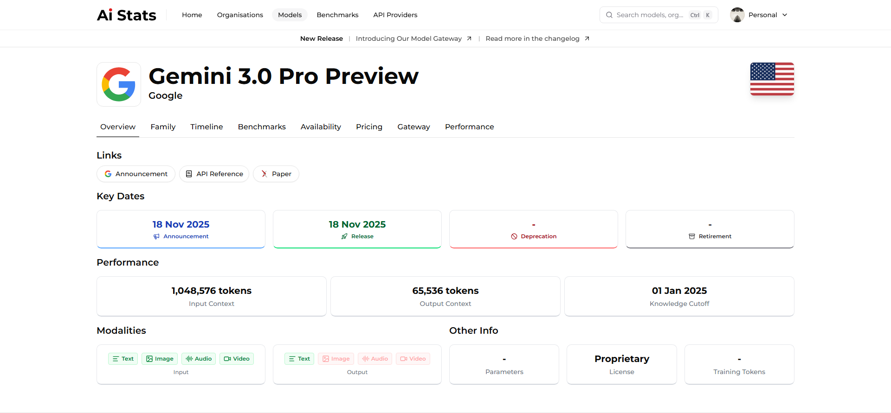

AI Stats maintains one of the largest open databases of **AI models** - spanning all types of models, from text and image to audio and video models from leading providers such as OpenAI, Anthropic, Google, Meta, Mistral, xAI, and more.

Each model page on AI Stats includes detailed technical and commercial information to help you evaluate, compare, and select the right model for your needs.

---

## What you’ll find on a model page

Every model on AI Stats contains the following key sections:

| Section          | Description                                                                                                                    |
| ---------------- | ------------------------------------------------------------------------------------------------------------------------------ |
| **Overview**     | Includes provider, release date, model type (chat, code, embedding, image, etc.), and short description.                       |
| **Family**       | Easily see related models and their relationships.                                                                             |
| **Timeline**     | Visualises release history and major updates over time.                                                                        |
| **Benchmarks**   | Shows performance results across benchmarks, easily compare to nearest models.                                                 |
| **Availability** | Lists the providers that currently host this model and which endpoints it supports as well as subscription plan accessibility. |
| **Pricing**      | Displays detailed pricing in USD, normalised for easy comparison to make it easy to see what the model costs.                  |
| **Gateway**      | Direct links and quickstarts to try the model via the AI Stats Gateway (if available).                                         |
| **Performance**  | Real world usage statistics such as latency, uptime, and error rates from the AI Stats Gateway.                                |

---

## Example model page

Here’s an example of what a model’s data might look like within AI Stats:

---

## Comparing models

You can compare models side-by-side on metrics such as performance, pricing, and features.  
AI Stats automatically highlights differences and ranks models based on various benchmark averages.

<Columns cols={2}>
	<Card
		title="Compare Models"
		icon="scale"
		href="/v1/exploring/pricing-performance"
	>
		Analyse cost vs performance trade-offs to choose the right model for
		your workload.
	</Card>
	<Card
		title="View Benchmarks"
		icon="chart-column-increasing"
		href="/v1/exploring/benchmarks"
	>
		Understand how benchmark scores are gathered and standardised.
	</Card>
</Columns>

---

## Finding models by criteria

Use filters and tags across the AI Stats interface to locate models that fit your needs:

-   **By provider:** “Show all Anthropic models.”
-   **By capability:** “List models supporting JSON structured responses.”
-   **By benchmark:** “Top-10 models on GPQA.”
-   **By pricing:** “Models costing under $0.01 per 1K tokens.”
-   **By release date:** “Recently released models.”

Each filter combines seamlessly, letting you discover exactly what you need.

---

## Contributing model updates

Because AI evolves rapidly, AI Stats relies on contributors to keep model data accurate.  
You can submit corrections, add missing benchmarks, or suggest new metadata directly through GitHub.

<Card
	title="Contribute Model Data"
	icon="github"
	href="/v1/contributing/editing-a-model"
	horizontal
>
	Learn how to edit or update model information safely.
</Card>

---

## Next steps

Now that you understand how models are structured, you can move on to learn about the **organisations** that build them.

<Card
	title="Explore Organisations"
	icon="building"
	href="/v1/exploring/organisations"
	horizontal
>
	Discover the companies and research groups behind each model.
</Card>
